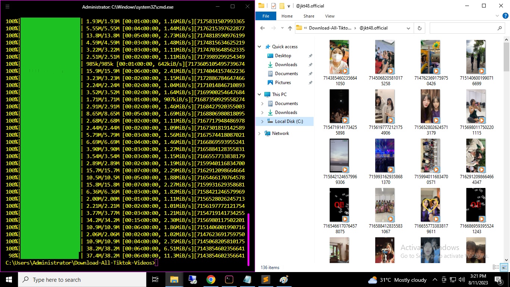

# Download All Tiktok Videos
Download all tiktok videos, with or without a watermark.

## Features
* Concurrent downloading
* Watermark free videos
* Watermarked videos
* Supports all TikTok URL formats
* No proxy needed

## Requirements
* Python 3.6 or higher: https://www.python.org/downloads/

## Installation
Step 1. Clone the repo.
`git clone https://github.com/xsrazy/Download-All-Tiktok-Videos`

Step 2. Enter the directory
`cd Download-All-Tiktok-Videos`

Step 3. Create and activate your virtual environment.

Create: `python -m venv venv` or `python3 -m venv venv`

Activate: Windows `.\venv\Scripts\activate` | Linux `. venv/bin/activate`

Step 4. Install requirements
`pip install -r requirements.txt` or `pip3 install -r requirements.txt`

## Available Options
```
usage: run.py [-h] [--links LINKS] [--no-watermark | --watermark] [--workers WORKERS]

options:
-h, --help show this help message and exit
--links LINKS The path to the .txt file that contains the TikTok links. (Default: links.txt)
--no-watermark Download videos without watermarks. (Default)
--watermark Download videos with watermarks.
--workers WORKERS Number of concurrent downloads. (Default: 3)
```

## How To Use
Paste all the TikTok video links you want to download into a .txt file (one link per line), save it and follow the basic usage examples. 
In the example below, the links are saved in a links.txt file:
```
https://www.tiktok.com/@jkt48.official/video/7264964200836140294
https://www.tiktok.com/@jkt48.official/video/7262714248206241029
https://www.tiktok.com/@jkt48.official/video/7261860749646089478
https://www.tiktok.com/@jkt48.official/video/7261652862185262342
https://www.tiktok.com/@jkt48.official/video/7261636869954260229
```
Link Grabber: https://chrome.google.com/webstore/detail/link-grabber/caodelkhipncidmoebgbbeemedohcdma

### Basic Usage Examples
Run the following commands according to how you want your videos to be downloaded
1. `python run.py` : Downloads the videos with default options. It assumes that you want to download watermark free videos and the links are in the links.txt file.

2. `python run.py --watermark`: Downloads the watermarked version of the videos. It assumes that the links are in the links.txt file.

3. `python run.py --no-watermark`: Downloads the watermark free version of the videos. It assumes that the links are in the links.txt file.

4. `python run.py --no-watermark --links links.txt`: Downloads the watermark free version of the videos by using the links in links.txt file.

5. `python run.py --watermark --links example.txt --workers 8`: Downloads the watermarked version of the videos by using the links in the links.txt file. 8 videos will be downloaded at a time.

### Note
* A folder will be created for each unique user. This folder will contain the downloaded videos.
* Videos that have been previously downloaded will be replaced when the script is run again.
* The videos are saved and renamed according to their video IDs.
* Any link that had an error will be logged in an errors.txt file.

<a href="https://www.buymeacoffee.com/xsrazy" target="_blank"></a>
